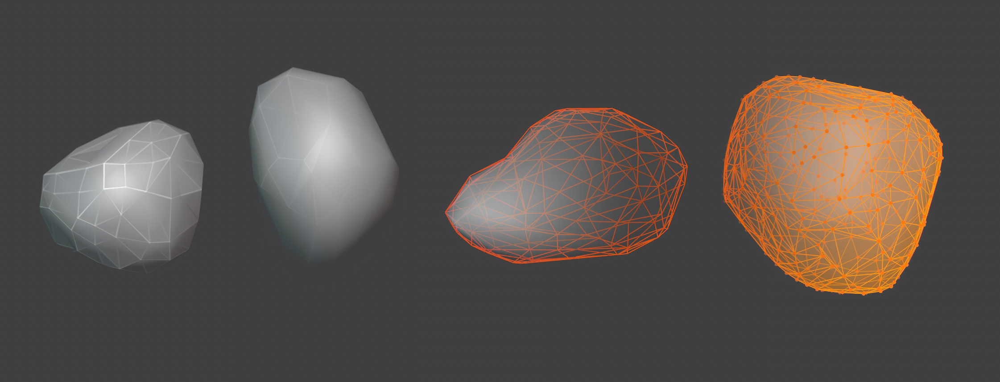

# LPRocks

**LPRocks** is a lightweight Blender addon for quickly generating and modifying rocks.  
It uses procedural displacement and decimation to create unique rock shapes, optimised for games, stylized shader driven materials, and rapid prototyping.
It can also be used as a base for sculpting or further modelling.

## Features

- One-click rock generation with customisable parameters.
- Adjustable random seed for infinite variations.
- Control final resolution with a simple slider.
- Option to apply or keep modifiers for further manual editing.
- Smooth shading toggle.
- Clean, minimal UI panel integrated into the Blender sidebar.

## Installation

1. Download the package
2. In Blender, go to `Edit > Preferences > Add-ons > Install`.
3. Select the `.zip` package.
4. Make sure that **LPRocks** is Enabled in the addon list.

## How to Use

- Open the sidebar (`N` key) and find the **LPRocks Generator** panel.
- Adjust the parameters as needed:
  - **Apply Modifiers** — automatically finalise your rocks or keep them editable. 
  - **Random Seed** — change the shape variation.
  - **Output Resolution** — set how low-poly the result should be.
  - **Smooth Shading** — enable or disable smooth shading.
- Click **Generate Rock** to create a new rock in the scene.

If you choose not to apply modifiers immediately, additional tools like **Edit Displace** and **Apply Modifiers** become available. 
Move the newly generated rock in 3D space to change its shape. Edit or sculpt before applying the modifiers.

## Requirements

- Blender 3.0 or later.

## License

Feel free to use it in personal or commercial projects under the terms of the GNU General Public License.

---

If you have any questions, suggestions, or issues, please open an issue on the [GitHub repository](https://github.com/nx-sm/BlenderRockGenerator/pulls)